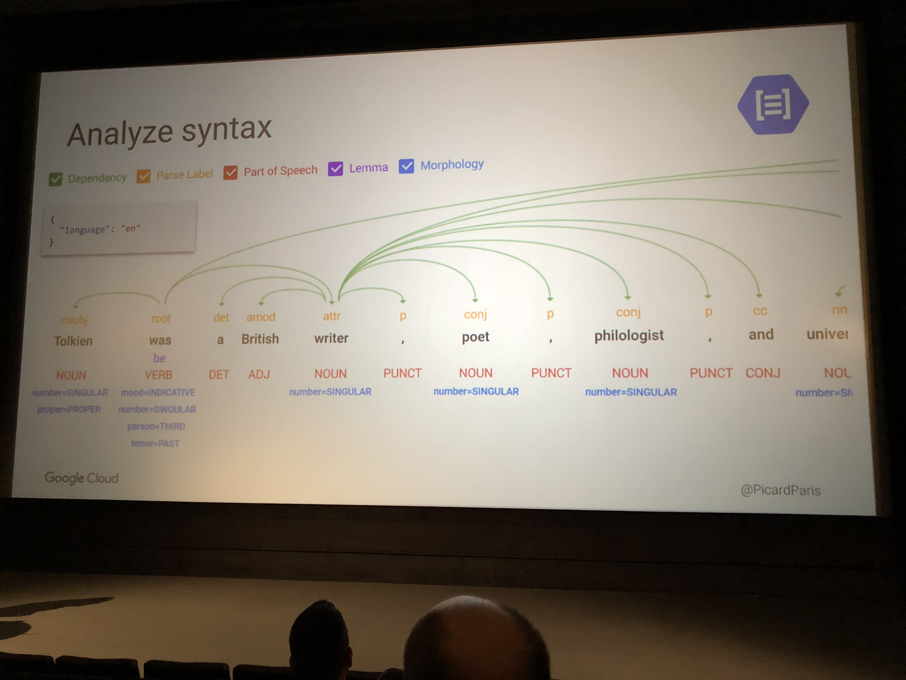

# code.talks 2018

## Der Aufhänger

ESONO bietet seinen Entwicklern pro Jahr fünf RnD (Research and Development) Tage an. In diesen Tagen kann jeder Entwickler selbst entscheiden, mit was er sich gerne beschäftigen würde. Eine Option ist auch der Besuch einer Konferenz. Ein Kollege und ich entschieden uns für Letzteres und ich will ein paar Worte über unsere Erfahrung dort verlieren.

Alle Meinungen und Bewertungen über Sachverhalte, Talks und Teilnehmer sind natürlich meine ganz persönlichen und repräsentieren nicht zwangsläufig die Einstellung von ESONO und deren Mitarbeiter.

## Die Veranstaltung

Die code.talks sind eine non-profit Veranstaltung, die sich an Entwickler aus dem weit gefassten Bereich der Web-Entwicklung wendet.

Die Veranstaltung wird finanziert von Sponsoren und AboutYou. Es werden auch kostenlose Tickets an Studenten und Programmierer in der Ausbildung gegeben, um den Nachwuchs zu fördern. Das Konzept ist sehr zu begrüßen und sorgte dafür, dass das Publikum nicht nur aus Abgesandten großer Firmen bestand.

Auch wenn es auffällt, dass beispielsweise im Vergleich zu der jährlichen Symfony Live durchaus einige weibliche Mitglieder der Community anzutreffen waren, beklagte der Veranstalter bei der Eröffnung das immer noch eklatant ungleiche Geschlechterverhältnis. Die Veranstaltung gibt sich sehr viel Mühe, unterrepräsentierte Gruppen besser zu fördern und auf der Veranstaltung zu begrüßen. Das gelinge allerdings trotz starker Bemühungen immer noch nicht zufriedenstellend.

## Die Location

Die code.talks fanden - wie jedes Jahr - in einem Cinemaxx Kino statt. Ein Kino ist im Grunde ein sehr guter Ort für eine derartige Veranstaltung, da es viele große Räume für Vorträge gibt. Diese haben sensationell große Leinwände für die Slides und ein gutes Blickfeld für jeden Besucher. 

Kinosessel sind für einen zwei Stunden langen Film vielleicht noch in Ordnung, wenn man allerdings zwei Tage hintereinander insgesamt gefühlte 80000 Stunden in ihnen verbringt, schwindet die Begeisterung ein wenig. Gepaart mit schwindendem Sauerstoffgehalt in der Luft und fehlendem Sonnenlicht stellt das Ganze dann eine Herausforderung der ganz besonderen Art dar. 

## ESONO bei den code.talks

ESONO schickte einen Kollegen und mich zu der ausverkauften Veranstaltung 2018.

Laut Veranstalter gab es mehrere hundert Entwickler auf der Warteliste für Tickets. Diese müssen sich allerdings wirklich auf den letzten Drücker angemeldet haben, da auch ESONO die Tickets erst in der Woche der Veranstaltung online bestellte. 

## Die Tracks

Die Veranstaltung bot insgesamt 16 Tracks an, die von Mobile, über Management bis zu Security reichten und im Grunde das komplette Spektrum der Entwicklerszene abdeckten. Pro Slot gab es 8 parallele Tracks, was durchaus zu einigen schwierigen Entscheidungen führen konnte, auch wenn die Tracks hinreichend unterschiedlich waren, so dass man ein einigermaßen konsistentes Konferenzprogramm zusammenstellen konnte, ohne auf persönliche must-see Vorträge verzichten zu müssen.

Die Talks, die hier vorgestellt werden, sind diejenigen, für die ich mich entschieden habe. Über die anderen kann ich leider nichts sagen. Diese wurden zwar aufgezeichnet, aber wann und ob diese veröffentlicht werden, konnte mir niemand so recht beantworten.

## Welcome Speech

Kino 1, voller Raum, große Leinwand. Einer der Organisatoren stellt die Veranstaltung vor und sagt im Grunde das, was ich bereits in der Einleitung zu diesem Post beschrieben habe.

Auch wenn der Talk einige interessante Punkte und Informationen enthielt, geriet er für mich doch etwas zu lang.

Es wurden auch die Tracks einzeln von den jeweiligen Kuratoren vorgestellt. Das ist im Prinzip eine gute Idee, allerdings artete es ein bisschen in eine trockene Aufzählung der Vorträge aus. Das war redundant und nicht informativ. Dennoch begrüße ich diese Art der Einführungsveranstaltung. Sie ist ein guter Einstieg, der die Motivation und das Konzept einer Konferenz aufzeigt.

## All your money belongs to us (me)

#### Denis Hamann - Netlight Consulting GmbH

Auf vergangenen Veranstaltungen des Chaos Computer Clubs hat man bereits sehr interessante Vorträge zum Thema gesehen: Das Kompromittieren von Mobile Banking Apps.

Der hier beschriebene Angriff - am Beispiel der PayPal App - nutzte Code Injection zur Runtime.

Hier wird direkt Java Code der laufenden App manipuliert. Das ist natürlich nur durch die Kompromittierung des Gerätes möglich, wogegen die App nicht wirklich etwas unternehmen kann, selbst wenn sie wollte. Aber Denis bemerkt, dass das vor allem ein PR Desaster für den Anbieter darstellt, was ein interessanter Punkt ist. Konsumenten ist es egal, wie absurd der Angriff ist. Wenn er gezeigt wird, ist es das Problem des Anbieters.

Wichtigster Hinweis des Vortrags zum Schutz vor derartigen Angriffen: Update your Phones!

Und da ich das auch noch mal betonen will, hier noch mal: Update. Your. Phones! Srsly. 

Dementsprechend sind auch hauptsächlich alte, niemals aktualisierte Android Telefone anfällig, oder wie Denis es nennt: "cheap china phones".

Denis blieb beim gesamten Vortrag oberflächlich und gab einen nur im Ansatz technischen Einblick in die Methoden. Das hat mich ein wenig enttäuscht, aber das ist kein Problem von Denis' Vortrag sondern von meinen Erwartungen. 

## Predictive Analytics with Big Query

#### Christopher Denk - Google

#### Ksenia Nekrasova - Google

Auch Google war mit mehreren Vorträgen bei den code.talks. Im Grunde wollte Google hier ihre neuen Produkte im Bereich Machine Learning vorstellen.

Dieser Vortrag hatte allerdings den Fokus auf Big Query und wie man die Google Cloud zum Analysieren riesiger Datenmengen nutzen kann.

Als Beispiel nahmen Ksenia und Christopher einen Hotelbetrieb, der seine Kunden besser analysieren möchte, um den Service zu verbessern.

Als Datenquellen dienten ein Loyality Program, Website Analytics, Hotel Properties und Room Bookings. Alle Daten wurden zusammengesammelt und in ein Google Data Warehouse gekippt. Das ganze System kann mit Daten von mehreren Petabytes umgehen. Dafür werden die Tables in einzelne Shards aufgeteilt, um sie besser skalieren zu können.

Die Daten liegen als semi-structured data types vor in Form von Structs und Arrays. Sie haben ein "Partial Schema", was meines Erachtens nach "haben die selbe Form, die wir aber nicht so wirklich definiert haben" klingt. Da sollte man sich wohl mal tiefer mit beschäftigen.

Wichtige Daten für das Hotel waren zum Beispiel Searchterms (honeymoon, cheap hotel, parking opportunities). Dadurch findet man die Zielgruppen (Business, Couples, Family...) und man kann in der Folge beispielsweise personalisierte Newsletter generieren.

Der Vorteil dabei, solche Analysen in der Google Cloud zu machen, liegt natürlich darin, sich nicht um Infrastruktur und Skalierbarkeit kümmern zu müssen.

In der Folge wurde noch die Beta von BQML vorgestellt. Das ML darin steht - natürlich - für Machine Learning.

Das Beispiel hier waren Kunden, die nicht angegeben haben, ob sie verheiratet sind. Daraufhin wurde in der Cloud trainiert und dann die fehlenden Angaben ergänzt. Spooky. 

Insgesamt war das ein schöner Talk mit Live Demo und kompetenten Speakern.

## A day in the life of a security consultant - Story telling around DDoS and web attacks

#### Gerhard Giese - Akamai

Gerhard fing gleich mit den berühmt berüchtigten 419 Scam Mails an. Das sind die mit dem Millionen Erbe aus Nigeria, dessen glückliche Empfänger wir sind. Er ließ es sich auch nicht nehmen, dabei auf das sensationelle 419eater.com hinzuweisen.

Erstaunlicherweise sind diese Scam Mails - so absurd und offensichtlich sie sind - bis heute erfolgreich. Es gibt immer noch Opfer, die darauf hereinfallen. Sein Fazit dazu: "Gier ist ein schlechter Berater".

Desweiteren stelle Gerhard eine Drohung vor, die mir bisher noch nicht untergekommen ist, die aber wohl auch verbreitet ist: Zahle oder wir fahren eine DDoS Attacke auf deinen Server. Auf die Frage, ob man denn zahlen sollte, meinte er, dass dann nur der nächste kommen würde, da es einfach zu viele solcher Kriminellen gibt. Er würde aber nicht so weit gehen, sie als vernetzt anzusehen, nach dem Motto: "Schau mal, der hat bei mir gezahlt, greif den mal an!"

Am häufigsten wird Retail Opfer dieser Angriffe.

Gerhard stellte außerdem folgenden schönen Angriffsvektor vor: Sonos hacken und darüber Alexa steuern. Next Level: Per Ultraschall mit Siri sprechen. Das klingt lustig und abgefahren, ist aber ein realer Angriff.

Sein Rat: Als Programmierer den Hut abnehmen, die Hacker Basecap aufsetzen und mal aus der Box steigen. Das ist sicherlich ein guter Hinweis, den so einige Entwickler beherzigen sollten.

Ein sehr unterhaltsamer und informativer Talk. 

## Software Qualität === Gesundheit

#### Roland Golla - Never Code Alone

Roland erlitt vor einiger Zeit einen Nervenzusammenbruch. Als Auslöser beschrieb er das, womit so ziemlich jeder Entwickler tagtäglich zu kämpfen hat:

Es kommen immer mehr Tickets, immer mehr Bugs, die Arbeit wird zur Kesselflickerei, weil keine Zeit für gescheite Lösungen da ist, das führt zu noch mehr Bugs, noch mehr Tickets etc.

Das klingt übertrieben, aber so ist es leider in vielen Betrieben.

Außerdem gibt er den guten Hinweis: Wenn du nur alten Legacy Code fixt, bist du nichts mehr Wert auf dem Markt, da Technologie voranschreitet, du selbst aber nicht. Das ist ein Hinweis, der sich durch die gesamte Veranstaltung und durch mehrere Talks hindurchzieht. Es scheint sich also um ein vorherrschendes Problem in der Entwicklerszene zu handeln. Entwickler verheizen sich mit dem Flicken alten Codes und werden dadurch nicht nur depressiv, sondern nehmen sich nach und nach auch immer mehr die Möglichkeit, am Markt noch mal zu etwas Besserem zu kommen.

Bekämpft den Burn Out, fordert gute Bedingungen ein, schaut auf euch und eure Gesundheit. Mehr kann ich dazu auch nicht sagen.

## Hilfe - Kind im Brunnen: Systematisch technische Schulden abbauen

#### Gernot Starke - INNOQ

Gernot wurde mir im Vorfeld bereits empfohlen als guter Speaker und Mensch mit Ahnung. Ich habe seine Bücher bisher nicht gelesen, aber nach dem Vortrag sind sie auf jeden Fall auf meiner Liste gelandet.

Es geht wie so oft um alte Systeme, die in einem Wust von Abhängigkeiten, Gluecode und Legacycode untergehen. Es wird versucht, Systeme zu integrieren und dabei wird außer Acht gelassen:

"Integrationsprojekte kann man entweder schnell machen, oder gut."

Das Management hat bei einem Integrationsprojekt die beiden Ziele: Termin einhalten und Budget nicht überschreiten. Diese Ziele sprechen gegen das Ziel des Engineerings, eine wartbare und gute Lösung zu entwickeln.

Gernot stellt sein eigenes System aim42.org vor, das dabei helfen soll, derartige Projekte vernünftig zu planen.

Ein wichtiger Punkt, den er anspricht, ist, dass Problemraum und Lösungsraum voneinander getrennt werden müssen. Zu oft denken gerade Entwickler direkt in Lösungen - was nicht verwunderlich ist, da genau das ihr Job ist. 

Und auch Gernot spricht das wiederkehrende Thema an:

"Ohne Innovation sinkt der Marktwert der Entwickler!"

Um ein System zu verbessern, muss man Verbesserungen mit dem Tagesgeschäft kombinieren. Es muss eine kontinuierliche Architektur-Modernisierung stattfinden.

Änderung braucht Zeit, der Erfolg muss nachweisbar sein über die Zeit. Beweise dem Management, dass die Änderungen kontinuierlich zu Verbesserung führen.

## 1's and 0's: Golang and WebAssembly

#### Guus van Weelden - Loodse

Guus beschreibt in seinem Talk das experimentelle Feature des WebAssembly Compilation Targets in Go 1.11. 

WebAssembly ist ein Binary Instruction Format für den Browser, das im Vergleich zu JavaScript eine kleinere Dateigröße und eine schnellere Ausführung bietet. Das mit der kleineren Dateigröße ist aber aktuell bei wasm Modulen, die aus Go kommen, noch nicht wirklich gegeben, da diese immer mindestens 2MB (500kb compressed) groß sind. Dafür genießt man die Vorteile von Go, also zum Beispiel bestehende Libraries und Typensicherheit.

Theoretisch ist es dadurch auch möglich, den selben Code im Frontend und Backend zu verwenden (code sharing). Das ist aber etwas, das in meiner Erfahrung immer nur im theoretischen Beispiel (Input Validation) vorkommt und in der Praxis so gut wie nie hilfreich ist. Frontend und Backend sind zwei derart unterschiedliche Welten, da ist fehlendes Codesharing das letzte Problem, das mir einfällt.

Darüber hinaus ist wasm aber sicherlich effektiver, standardisiert, sandboxed und bietet Support für viele unterschiedliche Sprachen.

WebAssembly unterstützt aktuell noch keine nativen DOM APIs. Hierfür muss noch Gluecode herhalten.

Außerdem besteht noch kein Multithreading-Support.

Ich werde noch einmal etwas auf WebAssembly eingehen in einem späteren Talk.

## Building smarter apps with Machine Learning, from magic to reality

#### Laurent Picard - Google

Wieder ein Vortrag von Google, dieses Mal mit dem sehr sympathischen Franzosen Laurent Picard. Er sprach über die Machine Learning APIs (Image, Text, Speech) von Google.

Das Besondere an seinem Talk war, dass er das Publikum mit einbezog, was sehr mutig ist. Das Publikum war aber dankbar und bestrafte ihn nicht für seinen Mut. 

Für die Visions API ließ er die Besucher Selfies hochladen, die dann mit einem Schnurrbart versehen wurden. Außerdem interpretierte die API die aktuelle Laune des Besuchers und gab Statistiken aus.

Für die Translation API ließ er sich dann Texte schicken, die ins Englische übersetzt wurden. Auch hier wurde die Emotion von dem Service interpretiert und mit einer prozentualen Einschätzung der Genauigkeit ausgegeben.

Kurz stellte Laurent auch noch die Text-To-Speech API vor, welcher er in einem persönlichen Gespräch danach auch durchaus eine gewisse  Creepiness zusagte.

AutoML kam ebenfalls zur Sprache. Damit kann man seine eigenen Daten trainieren und eine eigene API in der Cloud haben. Als Beispiel stellte er vor, wie man damit der Visions API beibringen kann, nicht nur Wolken als solche zu erkennen, sondern auch deren Typ. Hierzu trainiert man AutoML mit eigenen Bilddaten. 

Ich persönlich finde diese Beispiele immer etwas schwierig, da sie Einfachheit vorspielen. Klar, auf einem technischen Level ist das alles viel simpler, als auf einer grünen Wiese damit zu beginnen. Aber so eine Wolkenerkennung trainiert sich auch nicht mit 3 getagten Bildern. Im Beispiel trainierte er den Service mit hunderten getagter Bilder pro Wolkenart. Diese muss man eben auch erst mal produzieren. 

## Digitalpolitik 2018 - geht da noch was?

#### Nico Lumma - next media accelerator

Digitalpolitik in Deutschland ist für Nico Lumma "Fake it until you make it". Ja, wir machen einen Breitbandausbau. Irgendwann. Es wird geredet, aber nichts gemacht.

Für mich ist Nico Lummas Auftreten die wandelnde Bildkolumne. Mit dem Unterschied, dass er meistens Recht hat mit dem, was er sagt. Er versteht es, unterhaltsam und eindringlich vorzutragen.

Nico beklagt in diesem Talk die Prioritäten, die in unserer Politik derzeit - und auch schon seit langer Zeit - gesetzt werden. Als einen Grund für den Mangel an Digitalthemen ist, dass man einen Mindestlohn einfach besser den Leuten erklären kann als die Notwendigkeit eines Breitbandausbaus.

Und eigentlich sind die Voraussetzungen für ein Vorankommen in der Digitalpolitik ganz gut. 90% aller Deutschen über 14 Jahre sind online. Es handelt sich durchaus um ein aktuelles Thema.

Doch das Dauerthema sind Flüchtlinge. Nico Lumma will der Wichtigkeit des Themas nichts absprechen, aber andere Themen werden überproportional davon verschluckt.

Das Bildungssystem wird nicht verändert, "das könnte ja Leute irritieren".

"Wir haben doch auch Wasser und Strom überall hinbekommen, warum dann nicht Breitband? Kostet 100 Milliarden. Ist machbar und finanzierbar." Dem ist wohl nicht viel hinzuzufügen, wobei man bei Nico besser nochmal die genannten Zahlen überprüfen sollte.

Wie kommen wir jetzt weiter?

Nico empfiehlt, mit einem MdB zu reden und vom Leben zu erzählen. Die wissen das nicht und es interessiert sie. Wir als ITler haben nicht die Lobby, wie sie zum Beispiel VW hat. Aber wir sind viele. Leider sind wir gleichzeitig sehr zersplittert und werden deshalb nicht wahrgenommen.

China, USA und Europa fechten gerade die digitale Zukunft aus. Wir sollten da mitmachen.

Ein spannender Talk, der in seiner Art etwas populistisch rüberkam, aber vielleicht ist es genau das, was es manchmal braucht.

## Creating High-Performance Web Apps with WebAssembly

#### Konstantin Möllers - Baqend

Der zweite Talk über WebAssembly, dieses Mal mit etwas mehr Fokus auf WebAssembly und weniger auf Go, was daran liegt, dass Konstantin mit Rust arbeitet.

Der Talk ging etwas genauer auf die Eigenarten von WebAssembly (wasm) ein. Zum ersten Mal hörte ich davon, dass es durchaus auch sinnvoll sein kann, wasm im Backend mit node.js zu verwenden, um dort Dinge zu beschleunigen.

Im Frontend unterstützt mittlerweile jeder aktuelle Browser die Ausführung von wasm.

Ein Nachteil ist aktuell noch, dass es schwer zu debuggen ist, man sieht nur den stack based Code im Browser. Das ist nur wenig hilfreich.

Interessant fand ich die Tatsache, dass es in wasm kein string, boolean usw. gibt. Nur int32, int64 und so weiter sind dort vorhanden. In Rust und Go wird sich aber mit Gluecode darum gekümmert, so dass man dort diese Typen verwenden kann. Alles andere wäre auch absurd.

Schön waren die Benchmarks, die Konstantin präsentierte, um zu zeigen, wie viel schneller wasm im Vergleich zu JS tatsächlich ist. Den größten Boost sieht man dabei in Safari, wobei man auch sehen muss, dass Safari bei JS besonders langsam ist im Vergleich zu den anderen Browsern. In wasm trumpft Safari dann auf, was den großen Sprung erklärt.

## Nicht du bist das Problem, sondern die Komplexität

#### Alexander Jäger - Trustedshops

Ein sehr eindrücklicher Talk von Alexander. Was ist uns unsere begrenzte Lebenszeit wert? Was wollen wir? Was macht uns zufrieden?

Alexander präsentierte ein Manifest für ein besseres Leben. Er will Entwicklern bewusst machen, dass sie schlechte Arbeitsbedingungen, schlechten Code und schlechtes Management nicht tolerieren sollen und müssen.

In vielen Betrieben werden die Entwickler verheizt. "Was, der hat Kopfschmerzen? Mach mal weniger Licht."

Wir sind keine Ressource. Wir sollten uns nicht als solche behandeln lassen.

## Fazit

Eine sehr unterhaltsame und gut organisierte Veranstaltung. Über die sonstigen Begebenheiten kann man eine typische Postkarte schreiben: Essen lecker, Party gut, Leute nett. Gerne wieder.

Gespräche kamen einige sehr interessante zu Stande - der eigentliche Grund, warum man zu solchen Konferenzen geht, meiner Meinung nach. Diese Gespräche werde ich hier aus persönlichkeitsrechtlichen Gründen nicht rezitieren, da sie - auch wenn auf einer großen Konferenz gehalten - im Privaten stattfanden.

